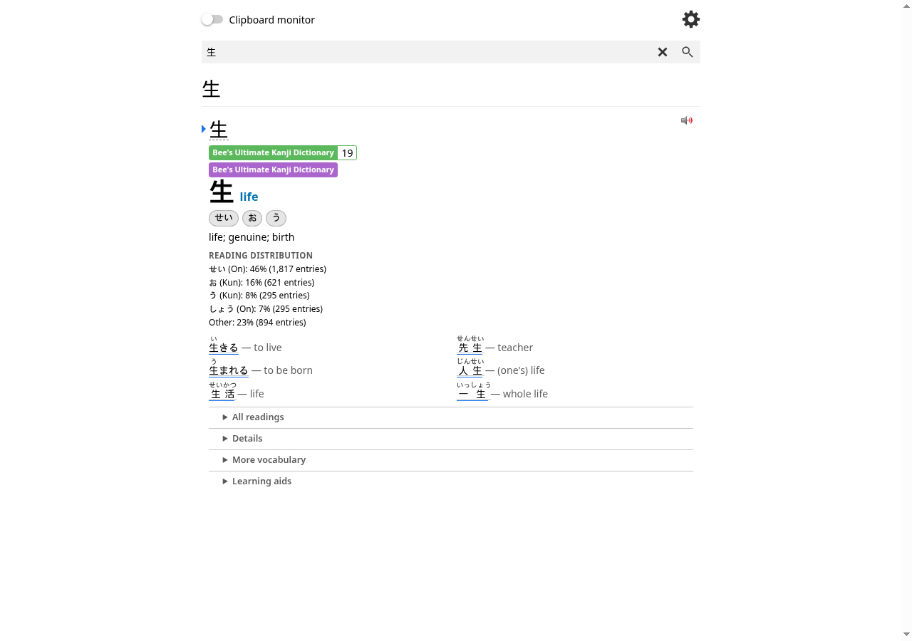
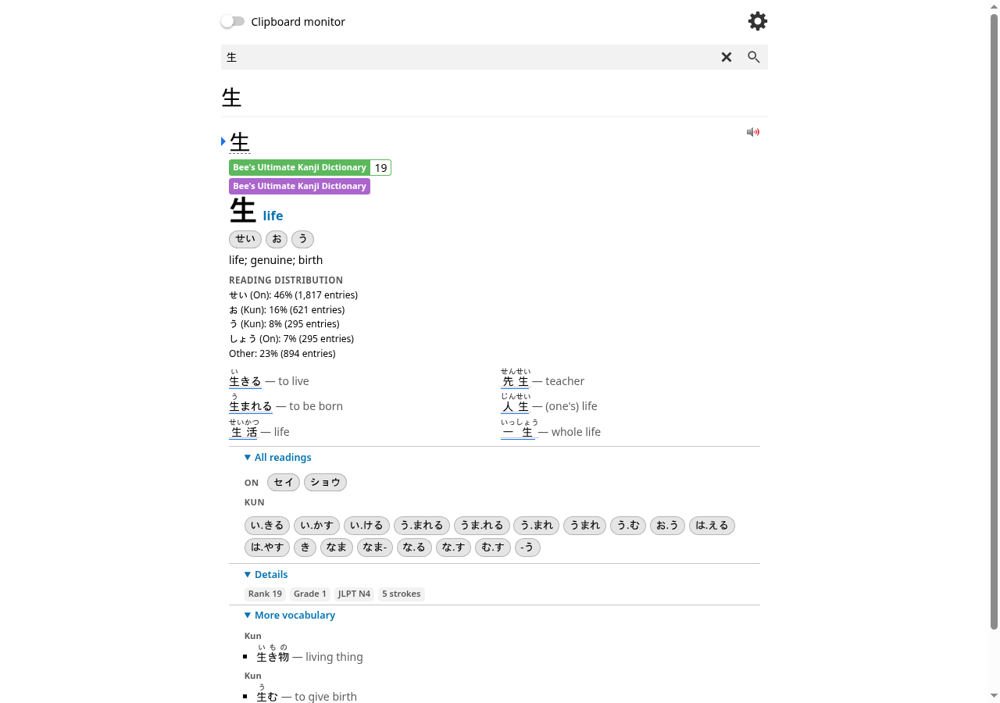
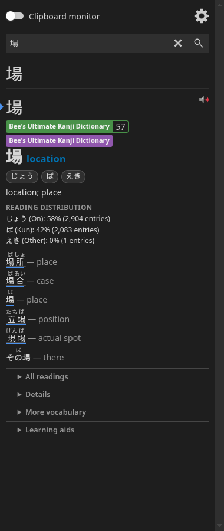
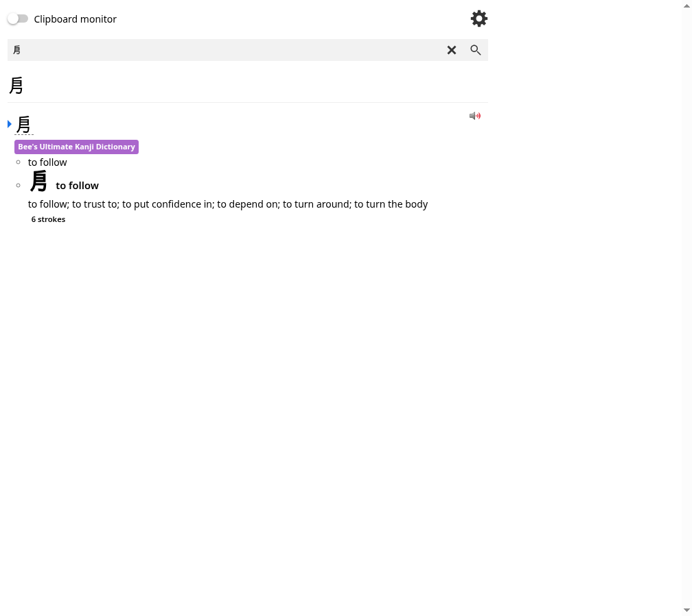

# Bee's Ultimate Kanji Dictionary

A self-updating Yomitan kanji dictionary built from
[Jiten](https://jiten.moe), with
[KANJIDIC2](https://www.edrdg.org/wiki/index.php/KANJIDIC_Project) fallback
coverage and [KanjiVG](https://kanjivg.tagaini.net/) learning aids.

**Download the canonical ZIP:**
[bees-ultimate-kanji-dictionary.zip](https://github.com/bee-san/bees-ultimate-kanji-dictionary/releases/latest/download/bees-ultimate-kanji-dictionary.zip)

## Screenshots

These are genuine, unmodified screenshots of the dictionary imported from the
canonical release ZIP into the **official Yomitan** extension (Yomitan Popup
Dictionary 26.7.29.0) — real Yomitan search results, not generated previews.
場 and 生 are fully enriched Jiten entries; a KANJIDIC2-only fallback character
renders a plainer card with just readings, meanings, and stroke data. A
full visual acceptance inventory lives in
[`docs/visual-qa/feature-inventory.md`](docs/visual-qa/feature-inventory.md).

| Enriched entry (生) | Expanded learning aids (生) | Narrow / dark (場) |
| :---: | :---: | :---: |
|  |  |  |

The KANJIDIC2 fallback is deliberately plain — no invented reading distribution,
ranks, or examples:



## Install

1. **Download** `bees-ultimate-kanji-dictionary.zip` from the
   [latest release](https://github.com/bee-san/bees-ultimate-kanji-dictionary/releases/latest).
2. In Yomitan open **Settings → Dictionaries → Import** and select the ZIP.
3. Hover a kanji; use Yomitan's dictionary update check to pull newer revisions.

## Features

- Jiten meanings, on/kun readings, frequency ranks, and common vocabulary
  examples grouped by reading (On / Kun / Other), chosen by Jiten rank and
  rendered with furigana.
- A **reading distribution** using Jiten's complete per-reading entry counts,
  shown as a concise heading followed by a plain text list of reading labels and
  percentages (with exact entry counts).
- **KANJIDIC2 fallback** for every character Jiten does not serve (English
  meanings, on/kun readings, stroke count, grade/JLPT), with no invented
  examples, ranks, or reading share.
- Static **KanjiVG** stroke-order diagrams (high-contrast and motion-free, with
  text fallback) and source-marked phonetic families.
- Accessible, compact CSS scoped to this dictionary's own markers; keyboard and
  screen-reader friendly.
- One self-updating canonical ZIP — no editions to choose between.

## Updating

Yomitan updates in place from the stable updater index and the latest ZIP:

```
https://raw.githubusercontent.com/bee-san/bees-ultimate-kanji-dictionary/main/dist/index.json
https://github.com/bee-san/bees-ultimate-kanji-dictionary/releases/latest/download/bees-ultimate-kanji-dictionary.zip
```

Yomitan reads the updater index on demand, sees a newer `revision`, and
re-downloads the canonical ZIP without disturbing your other dictionaries.

## Limitations and data semantics

- **English only.** Glosses and meanings are English.
- **Kanji-focused, not a full word dictionary.** Each character ships as a
  single structured **term** entry — that rich card (readings, meanings,
  vocabulary, and the reading distribution) is what you see when you scan/hover
  or search the character, the ordinary lookup path. It is not a general JMdict
  vocabulary dictionary.
- **One canonical surface, no native kanji card.** The package deliberately
  ships no native `kanji_bank`. Yomitan's separate "view kanji" drilldown (the
  `type=kanji` link) routes only to Yomitan's built-in flat kanji renderer,
  which dictionary CSS cannot style and which would hide the reading
  distribution. With no kanji dictionary shipped, that secondary drilldown simply
  reports "no results"; the full rich card is always delivered through the
  ordinary term lookup instead.
- **No audio and no pitch accent.**
- **Source freshness is once per UTC day.** Jiten, KANJIDIC2, and KanjiVG are
  fetched at most once daily; a release appears only when normalized content
  changes.
- **KANJIDIC2 fallback entries are plain** (meanings, on/kun, stroke count,
  grade/JLPT) with no examples, no frequency rank, and no reading distribution.
- **Reading distribution** is omitted when Jiten has no per-reading counts.

## Build and test

```bash
uv venv && . .venv/bin/activate
uv pip install -e . jsonschema
npm install
python -m bees_kanji        # writes build/ + refreshes dist/index.json
python -m pytest -q
```

Optional: `node scripts/validate_yomitan.mjs build/bees-ultimate-kanji-dictionary.zip`
validates the ZIP against the pinned official Yomitan schemas.

## Licences

Generator code is MIT (see `LICENSE`).

Dictionary **data** is redistributed under CC BY-SA 4.0:

> Dictionary data derived from Jiten (https://jiten.moe) and directly from
> KANJIDIC2, using JMdict/KANJIDIC data from the Electronic Dictionary Research
> and Development Group (EDRDG). Redistributed under CC BY-SA 4.0; see
> https://creativecommons.org/licenses/by-sa/4.0/ and
> https://www.edrdg.org/edrdg/licence.html.

**Stroke-order diagrams and phonetic families** are derived from
[KanjiVG](https://kanjivg.tagaini.net/) © Ulrich Apel, distributed under
CC BY-SA 3.0; the bundled SVGs are sanitized adaptations under the same
share-alike licence.

Both notices (`LICENSE-data.txt` and `LICENSE-kanjivg.txt`) are bundled inside
every release ZIP alongside the data.
