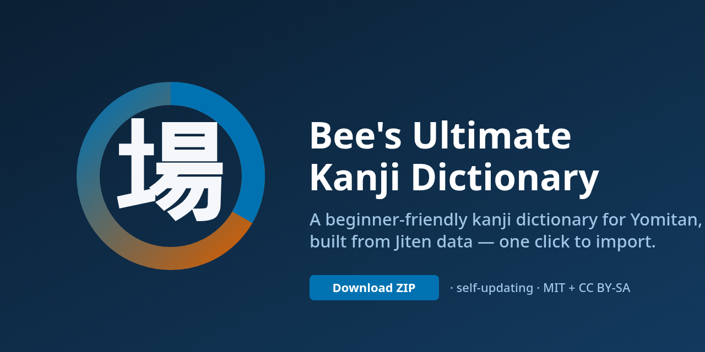

# Bee's Ultimate Kanji Dictionary

<p align="center">
  
</p>

<p align="center"><strong>A beginner-friendly kanji dictionary for
<a href="https://github.com/yomidevs/yomitan">Yomitan</a>, built from
<a href="https://jiten.moe">Jiten</a> data — one click to import.</strong></p>

<p align="center">
  <a href="https://github.com/bee-san/bees-ultimate-kanji-dictionary/releases/latest"></a>
  <a href="https://github.com/bee-san/bees-ultimate-kanji-dictionary/actions/workflows/release.yml"></a>
  <a href="LICENSE"></a>
  <a href="https://creativecommons.org/licenses/by-sa/4.0/"></a>
</p>

<p align="center">
  <a href="https://github.com/bee-san/bees-ultimate-kanji-dictionary/releases/download/latest/bees-ultimate-kanji-dictionary.zip"><strong>⬇ Download ZIP</strong></a>
  ·
  <a href="https://github.com/bee-san/bees-ultimate-kanji-dictionary/releases/latest">Latest release</a>
  ·
  <a href="#quick-install">Install</a>
  ·
  <a href="#build-it-yourself">Build it yourself</a>
</p>

A small, understandable generator that turns [Jiten](https://jiten.moe) kanji
data into a single canonical [Yomitan](https://github.com/yomidevs/yomitan)
dictionary, with [KANJIDIC2](https://www.edrdg.org/wiki/index.php/KANJIDIC_Project)
as a simple licensed fallback so the coverage reaches well beyond Jiten's live
set. It rebuilds once per day and publishes a self-updating ZIP that Yomitan
can update in place.

## What is this?

New Japanese learners who install a dictionary in Yomitan usually get raw
KANJIDIC-style output: a wall of readings and terse glosses with no sense of
*which* readings matter or how a character connects to the words that use it.
This project builds one Yomitan dictionary that keeps the honest data but
foregrounds what actually helps recall — the common readings, real vocabulary
grouped by reading, a truthful reading-distribution donut, and optional
stroke-order and phonetic-family learning aids — in a compact, accessible card.

Compared to importing raw KANJIDIC or general Yomitan kanji data, you get the
same underlying facts plus example vocabulary, a computed reading distribution,
and bundled stroke/phonetic aids in a single canonical ZIP. Compared to the
older compact helper, entries are richer and self-updating, with no editions to
choose between. Where Jiten serves a character its enriched entry is
authoritative; every remaining character KANJIDIC2 covers is added as an honest
fallback (English meanings, on/kun/nanori readings, stroke count, grade/JLPT
when present) with no invented examples, ranks, or percentages. Everything is
derived from Jiten, KANJIDIC2/KANJIDIC, and KanjiVG and attributed below — no
new claims are invented.

## Screenshots

These are an honest **package preview**: each image is rendered from the exact
structured content, `styles.css`, and bundled KanjiVG assets inside the shipped
release ZIP (via `scripts/render_screenshots.py`), so they show what Yomitan
draws from the package rather than an invented mockup. They show 場, a fully
enriched Jiten-sourced entry (the richest case); KANJIDIC2 fallback characters
render a plainer card with just their readings, meanings, and stroke data.

| Compact entry (場) | Expanded learning aids | Narrow / reduced-motion |
| :---: | :---: | :---: |
|  |  |  |
| A normal entry as it appears on hover. | Reading distribution, phonetic family, and stroke order. | Responsive layout with animation disabled and non-colour fallbacks intact. |

## Quick install

1. **Download** `bees-ultimate-kanji-dictionary.zip` from the
   [latest release](https://github.com/bee-san/bees-ultimate-kanji-dictionary/releases/latest).
2. In Yomitan open **Settings → Dictionaries → Import** and select the ZIP.
3. Hover over any kanji — Yomitan offers updates on demand when a newer
   revision is published.

## What you get

One Yomitan dictionary spanning **12,600+ characters** — every clean character
Jiten serves (with its full enrichment) plus every remaining character
[KANJIDIC2](https://www.edrdg.org/wiki/index.php/KANJIDIC_Project) covers as a
simple licensed fallback. Jiten-sourced entries prioritize what actually helps
recall:

- a **keyword / meaning** and a compact list of common senses,
- honest **on / kun readings** exactly as Jiten supplies them,
- a few **common vocabulary examples** grouped by reading (On / Kun / Other),
  chosen by word frequency rank and rendered with furigana,
- a compact, accessible **reading-distribution donut** whose percentages are
  computed truthfully from the very examples shown in the entry (never from
  Jiten's `totalWords`), with a visible text legend and a semantic fallback so
  no information depends on colour, SVG, or CSS alone,
- a keyboard-accessible **Learning aids** disclosure carrying:
  - the **phonetic family** — the kanji that share a phonetic component,
    sourced directly from KanjiVG's `kvg:phon` markers (never inferred), ordered
    by frequency rank, with a compact source attribution;
  - a **stroke-order diagram** built from sanitized KanjiVG stroke geometry with
    a lightweight, dependency-free CSS animation (reduced-motion guarded), plus a
    text stroke-count / component line that survives when the image, SVG, or
    script is unavailable,
- **rank, grade, JLPT, and stroke count** facts.

Presentation uses restrained, compact CSS (bundled as `styles.css` in the ZIP,
scoped to this dictionary's own `data-sc-bee-role` markers) with clear
hierarchy, progressive disclosure, reduced-motion support, non-colour fallbacks,
and keyboard/screen-reader accessibility.

Single-character term entries are preserved so ordinary dictionary clicks work,
and native kanji-bank entries are included from the same data. Frequency banks
use rank-based mode. Junk (`missing`, `???`, leaked markup, malformed ruby,
misleading `totalWords`-derived percentages) is removed. There is exactly **one
canonical ZIP** — no Core/Standard/Extended editions.

**KANJIDIC2 fallback entries** (characters Jiten does not serve) carry only the
fields KANJIDIC2 actually provides — English meanings, on/kun/nanori readings,
stroke count, and grade/JLPT when present — and honestly omit everything Jiten
would have supplied: no example vocabulary, no frequency rank or frequency-bank
entry, no reading-distribution donut, and no phonetic family or Jiten
attribution. Where a KanjiVG stroke diagram exists it is still attached (that is
KanjiVG data, not Jiten's). Jiten always wins on a shared character, so its
enriched entry is never weakened or overwritten.

## Updating

Yomitan offers updates when a newer revision is published: it checks the
updater index on demand when you run its dictionary update check, so you can
re-import the newest ZIP in place without losing your other dictionaries.

## Build it yourself

One command fetches (or refreshes from cache), normalizes, validates, and
builds deterministically:

```bash
uv venv && . .venv/bin/activate
uv pip install -e . jsonschema
npm install                      # adm-zip + ajv for schema validation
python -m bees_kanji             # writes build/ + refreshes dist/index.json
```

- Uses the unauthenticated Jiten API **once per UTC day**. There is no API key.
- Responses are cached under `cache/<UTC-date>/`, so a same-day rerun makes zero
  requests and an interrupted run fetches only the characters it still needs.
- KanjiVG stroke SVGs are acquired the same way — once per UTC day into
  `kanjivg-cache/<UTC-date>/`, resumable and cache-first — then sanitized and
  bundled. No API key, no extra acquisition machinery.
- The static [KANJIDIC2](https://www.edrdg.org/wiki/index.php/KANJIDIC_Project)
  XML (the licensed fallback source) is fetched once per UTC day into
  `kanjidic2-cache/<UTC-date>/`, reused on same-day reruns, and merged so every
  character it covers that Jiten lacks becomes an honest fallback entry.
- The build is reproducible: identical inputs produce a byte-identical ZIP.
- A new release is published only when the normalized dictionary content
  (including the bundled stroke/phonetic enrichment) actually changes; the
  revision is a monotonic dot-numeric UTC date.

Useful flags: `--limit N` (build the first N characters, for a quick check),
`--offline` (use the cache only), `--no-kanjivg` (data-only build, skip stroke
enrichment), `--no-kanjidic2` (Jiten-only build, skip the fallback expansion),
`--date YYYY-MM-DD`.

## Tests

```bash
python -m pytest -q
```

Focused tests cover 場 / 男 / 事 / 生 / 行 / 髙, malformed API data, the
Top-1000 quality floor, deterministic output, the reading-distribution donut,
KanjiVG phonetic families / stroke sanitization / animation fallback, the
KANJIDIC2 fallback parser and merge (Jiten wins on duplicates, fallback records
omit unsupported frequency/examples/enrichment, no duplicate characters, valid
Unicode), the Anki/Lapis field mapping, and validation against the pinned
official Yomitan schemas (also checked end-to-end via
`scripts/validate_yomitan.mjs`, which additionally verifies bundled SVGs are
sanitized and every referenced media asset resolves).

## Anki / Lapis cards

A small, copyable setup (no add-on, database, or template framework) lives in
[`anki/`](anki/): a Yomitan→Lapis field-mapping table plus minimal front/back
templates and styling that reuse the dictionary's own fields. See
[`anki/README.md`](anki/README.md). There is no audio or pitch accent.

## Licence

Generator code is MIT (see `LICENSE`). Dictionary **data** is redistributed
under CC BY-SA 4.0:

> Dictionary data derived from Jiten (https://jiten.moe), using JMdict/KANJIDIC
> data from the Electronic Dictionary Research and Development Group (EDRDG).
> Data is redistributed under CC BY-SA 4.0; see
> https://creativecommons.org/licenses/by-sa/4.0/ and
> https://www.edrdg.org/edrdg/licence.html.

**Stroke-order diagrams and phonetic families** are derived from
[KanjiVG](https://kanjivg.tagaini.net/) (© Ulrich Apel), distributed under
CC BY-SA 3.0. The bundled SVGs are sanitized adaptations, redistributed under
the same share-alike licence. See `LICENSE-kanjivg.txt`.

Both notices (`LICENSE-data.txt` and, when stroke assets ship, `LICENSE-kanjivg.txt`)
are bundled inside every release ZIP alongside the data.
